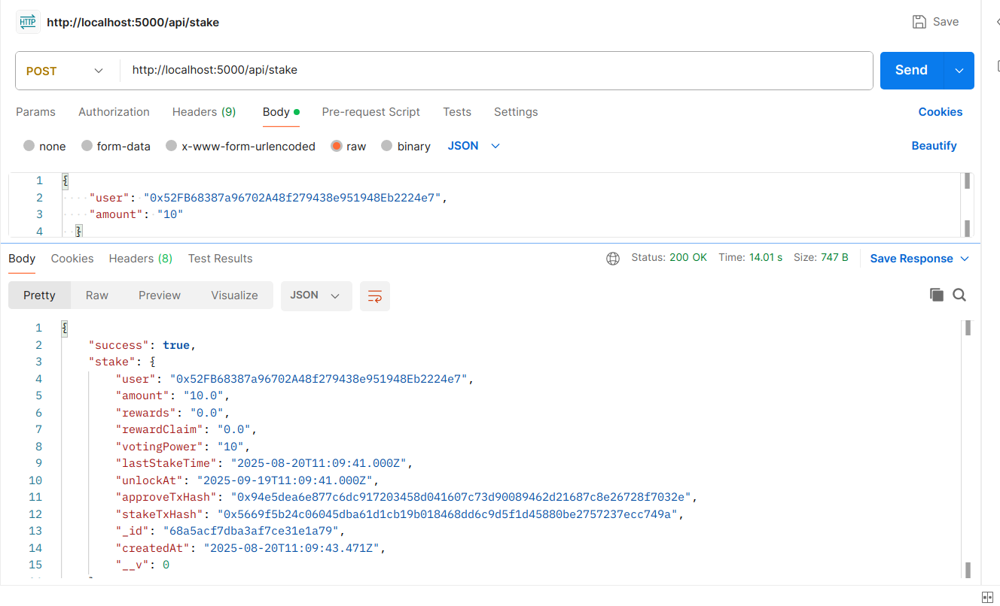
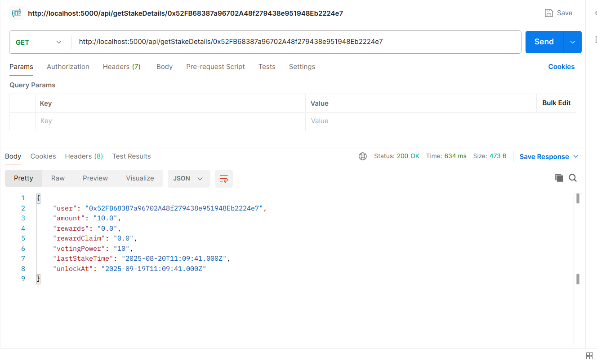
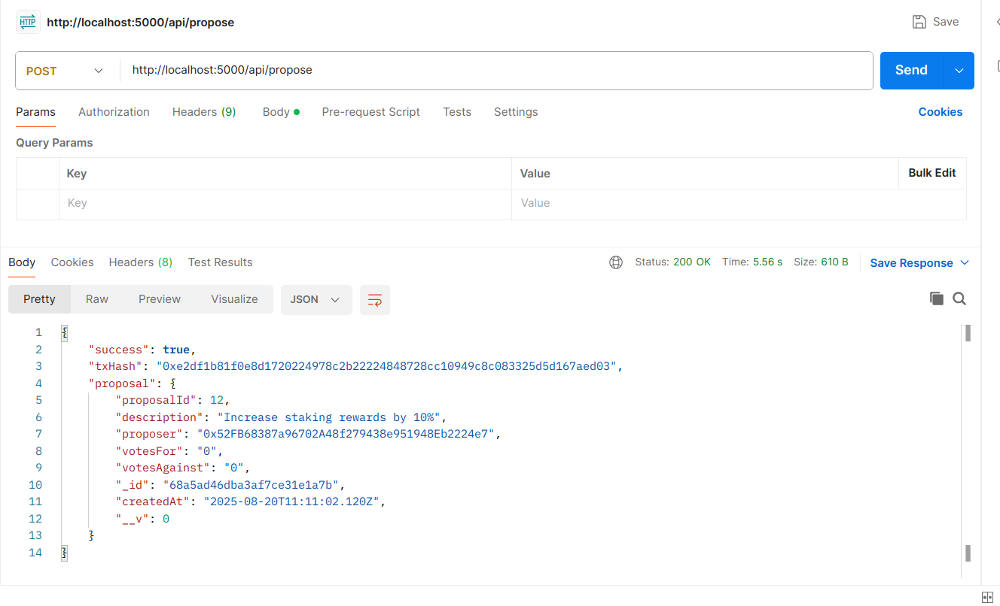
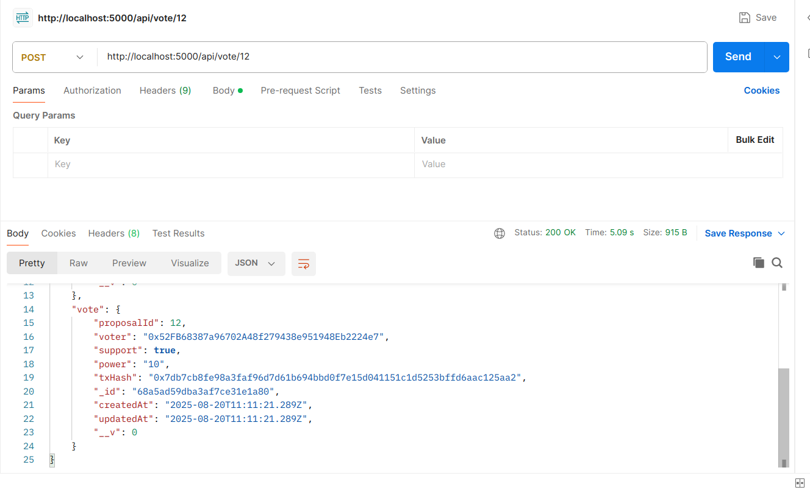

## API Testing Screenshots

### 1. Stake API Response

Shows the POST request to `/api/stake` and the JSON response after staking tokens.

### 2. Get Stake Details API Response

Shows the GET request to `/api/getStakeDetails/:user` and the JSON response with stake details.

### 3. Propose API Response
  
Shows the POST request to `/api/propose` and the JSON response after creating a new proposal.

### 4. Vote API Response
  
Shows the POST request to `/api/vote/:id` and the JSON response after voting on a proposal.

